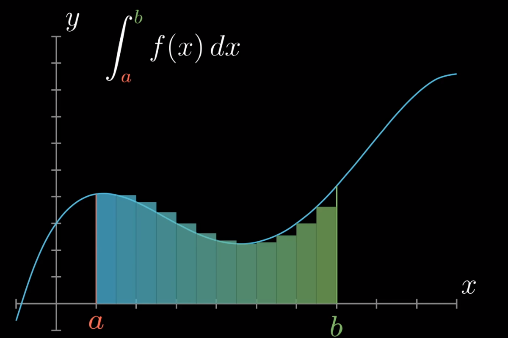
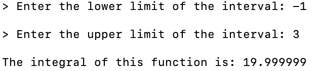

# Integral

## :pencil: Description

This is a C project where you change the function to whatever you want in the main.c fie, then launch
the project and set the integration limits, and then get the [integral](https://en.wikipedia.org/wiki/Integral)  value of this function with 
an accuracy of 1e-6!



## :runner: Run the program

```bash
make run # Launching the program
make clean # Clears the assembly
```

## :video_camera: Images

An example of how the program works!



## :sunglasses: Author

**Dima M. Shirokov**
- [GitHub](https://github.com/1123581321345589144233377610)
