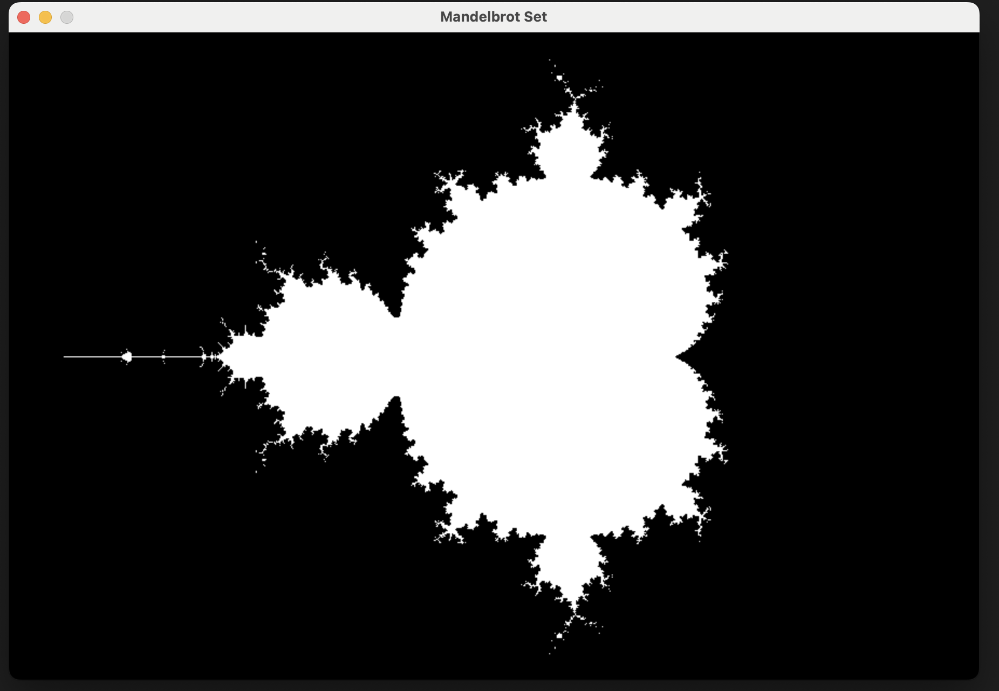

# Mandelbrot Set

## :speech_balloon: Description

This is a project that uses SDL2 library to draw a [Mandelbrot set](https://en.wikipedia.org/wiki/Mandelbrot_set).

## :books: Dependencies

To install SDL2, enter commands in the terminal depending on your operating system.

|MacOS|Linux|Windows|
|______|_____|_______|
|```bash brew install sdl2```|```bash sudo apt update && sudo apt install libsdl2-dev gcc```|```bash vcpkg install sdl2```|

## :arrow_forward: Running the program

```bash 
make run //Starts the program
make clean //Clean the assembly after program execution
```

## :camera: Images



## :bust_in_silhouette: Author

**Dima M. Shirokov**
- [GitHub](https://github.com/1123581321345589144233377610)


